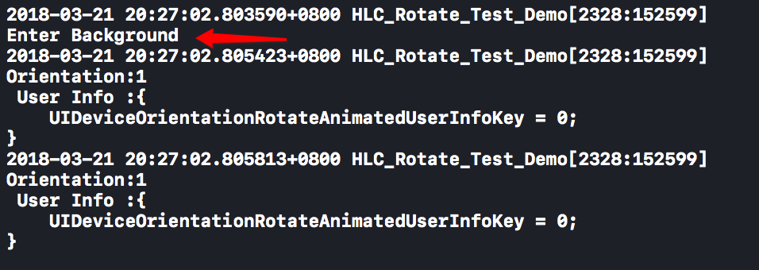
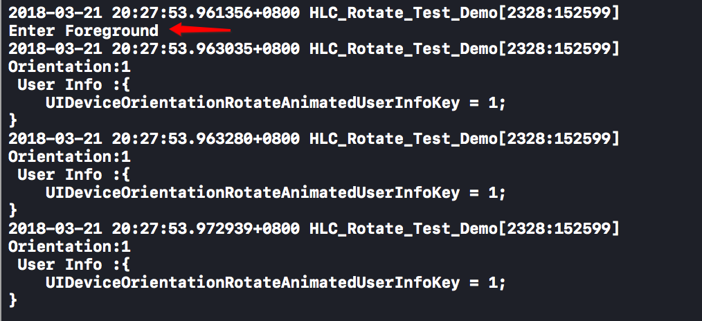
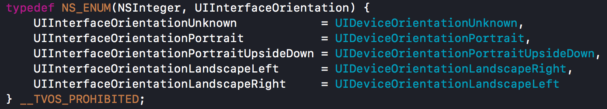
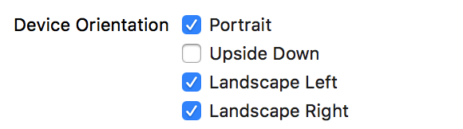

# iOS开发中屏幕旋转的那些坑

## 前言

随着苹果设备更新换代过程中，设备的屏幕尺寸也越做越大，设备上的应用可以自由旋转也被越来越重视。

如果iPad上的一个应用不能旋转，那么这必然将会为用户体验减分。

因此出现了`AutoLayout`技术和`Masonry`等其他一系列适配旋转的第三方库，旨在提升良好的用户体验。

当然今天说的不是自动布局问题，而是设备的旋转问题。

首先，请问大家监听屏幕旋转的时候，都监听的是哪个通知？

很多人都用用到`UIDeviceOrientationDidChangeNotification`，顾名思义，这个通知字面意思就是设备旋转改变通知。

是的，我们就聊一下这个通知的坑。

## 1.神奇的通知

为什么说`UIDeviceOrientationDidChangeNotification`这个通知是神奇的？

请按照以下步骤操作：

1. 监听`UIDeviceOrientationDidChangeNotification`通知。
2. 在监听回调方法中NSLog打印通知信息。
3. 启动应用，看看控制台的输出信息。
4. 不要旋转屏幕，让应用退到后台（command + shift + H），然后看控制台输出信息。
5. 然后再启动应用，看控制台的输出结果。

以下是我的控制台3次操作的输出信息：

**启动：**

**退到后台：**

**回到前台：**

可以看到虽然这3次操作中都没有进行旋转操作，但是都接收到了系统发出的旋转通知。

如果你在监听的方法中进行了消耗资源的响应动作或者进行了页面重新布局，那么这样的话就白白浪费了CPU时间，甚至会出错。

## 2.UIDeviceOrientation & UIInterfaceOrientation

在说`UIDeviceOrientationDidChangeNotification`通知之前，我们先看两个枚举类型。

对于初学者来说，`UIDeviceOrientation`和`UIInterfaceOrientation`很容易搞混，那这两个有什么不同。

1. `UIDeviceOrientation`是指设备方向，`UIInterfaceOrientation`是指用户界面。一个是指硬件，一个是指软件。

2. `UIDeviceOrientation`定义在`<UIKit/UIDevice.h>`中,而`UIInterfaceOrientation`定义在`<UIKit/UIApplication.h>`中。

3. `UIDeviceOrientation`有7个枚举可选值，通常只使用后6个。如下：
	 >UIDeviceOrientationUnknown, 
    >UIDeviceOrientationPortrait, 
    >UIDeviceOrientationPortraitUpsideDown, 
    >UIDeviceOrientationLandscapeLeft, 
    >UIDeviceOrientationLandscapeRight, 
    >UIDeviceOrientationFaceUp, 
    >UIDeviceOrientationFaceDown 
    
 而`UIInterfaceOrientation`只有5个枚举可选值,通常只用后4个。
 

所以两者的关系可以总结如下：

**1.UIDeviceOrientation改变时，UIInterfaceOrientation不一定改变。**

其中包括设备旋转屏幕朝上（UIDeviceOrientationFaceUp）、朝下（UIDeviceOrientationFaceDown）和用户禁止了界面旋转两种情况。

在项目工程中可以配置允许旋转的方向。

**2. `UIInterfaceOrientation`旋转触发时，`UIDeviceOrientation`一定改变。因为用户界面是根据设备方向来改变的。**

## 2.监听屏幕旋转的正确姿势

根据以上的总结内容，我们应该去`<UIKit/UIApplication.h>`中找看有没有相关定义的通知。

结果我们找到如下两个方法。
在不确定具体表示什么的时候，最直接的是去查官方文档。

1.`UIApplicationWillChangeStatusBarOrientationNotification`
>Posted when the app is about to change the orientation of its interface.

*释义*：当用户界面方向将要改变时，发出该通知。

>The userInfo dictionary contains an NSNumber that encapsulates a UIInterfaceOrientation value (see UIInterfaceOrientation). Use UIApplicationStatusBarOrientationUserInfoKey to access this value.

*释义*：该通知的userInfo包含了屏幕方向的枚举值，可以使用键`UIApplicationStatusBarOrientationUserInfoKey`去字典中访问该值。

2.`UIApplicationDidChangeStatusBarOrientationNotification`
>Posted when the orientation of the app’s user interface changes.

*释义*：当用户界面方向已经改变了，发出该通知。

>The userInfo dictionary contains an NSNumber object that encapsulates a UIInterfaceOrientation value (see UIInterfaceOrientation). Use UIApplicationStatusBarOrientationUserInfoKey to access this value.

*释义*：该通知的userInfo包含了屏幕方向的枚举值，可以使用键`UIApplicationStatusBarOrientationUserInfoKey`去字典中访问该值。

所以，监听`UIApplicationWillChangeStatusBarOrientationNotification`和`UIApplicationDidChangeStatusBarOrientationNotification`这两个通知才是正确的监听屏幕旋转的姿势。并且还可以得到界面改变之前的方向和改变之后的方向。

## 3.总结

虽然我们知道了怎样监听屏幕的旋转，但是本着深究问题的精神，对`UIDeviceOrientationDidChangeNotification`这个通知做简要讨论和猜测。

1.从通知的信息字典中打印出的`UIDeviceOrientationRotateAnimatedUserInfoKey`可以看到，该值有时为1，有时为0。去网上查找资料，发现几乎没有什么有用信息，官方文档也没什么说明信息。这可能是苹果官方认为我们根本无法用到这个键值。从字面看，大概意思是指“**方向旋转动画**”，应该是指旋转中是否使用了过渡动画。哈哈😆，不知道是不是这样的。

2.为什么在应用进入前台和后台的时候，系统都会发送这个通知？

我们知道，当应用进入后台了，便会被系统自动挂起，这时，应用的进程处于休眠状态，此时的应用是不会执行操作的，直到应用被重新唤醒或者被杀掉。

应用处于后台时，设备进行了旋转，监听设备旋转的一些方法就没法得到回调，无法进行相关操作。当重新唤起应用时，可能界面显示的结果不是用户期待的样子，这样就显得不是很友好。

苹果可能为了规避这一问题，在应用唤起的时候自动发送该通知，即使休眠期间设备的方向没有旋转过，让应用可以及时作出响应，提高了用户的体验。
 
 
### 备注

>本文系博主原创文章，欢迎转载，但请标注文章来源。
>
>文中若有晦涩之处，欢迎评论指正。

